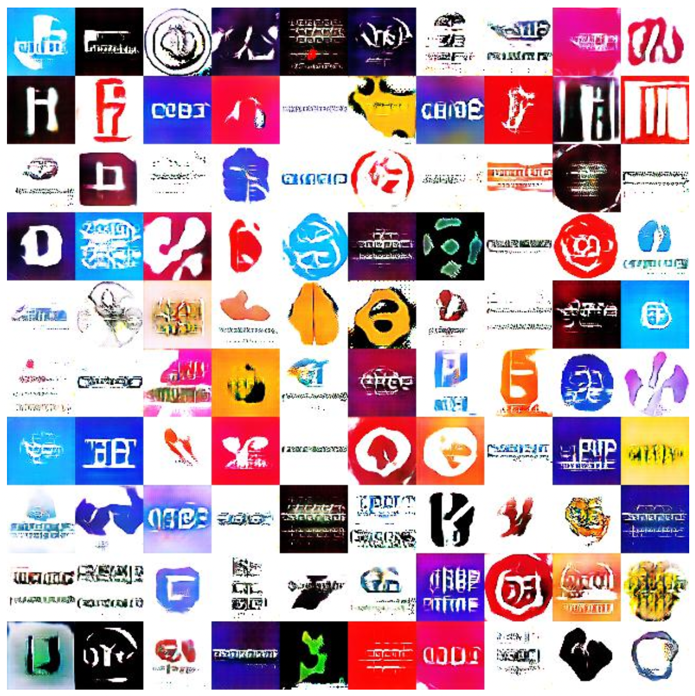

# Logo-GAN
Creating Logos using Generative Adversarial Networks. This is [my thesis](https://github.com/sriharsha-sv/Logo-GAN/blob/main/Thesis.pdf) for the conferral of my Masters degree at University of Hyderabad, India.

Tensorflow implementation of DCGAN, LSGAN, WGAN and WGAN-GP, and we use DCGAN as the network architecture in all experiments. This code is modified from LynnHo's [Github repository](https://github.com/LynnHo/DCGAN-LSGAN-WGAN-GP-DRAGAN-Tensorflow-2/tree/master/v1) to train on logos.


DCGAN: [Unsupervised representation learning with deep convolutional generative adversarial networks](https://arxiv.org/abs/1511.06434)

LSGAN: [Least squares generative adversarial networks](https://pdfs.semanticscholar.org/0bbc/35bdbd643fb520ce349bdd486ef2c490f1fc.pdf)

WGAN: [Wasserstein GAN](https://arxiv.org/abs/1701.07875)

WGAN-GP: [Improved Training of Wasserstein GANs](http://arxiv.org/abs/1704.00028)


## Results

DCGAN

   

LSGAN

   

WGAN

   

WGAN-GP

   

# Usage
```
python train_logo_dcgan.py
python train_logo_lsgan.py
python train_logo_wgan.py
python train_logo_wgan_gp.py
```

## Prerequisites
- tensorflow r1.2
- python 2.7

## Dataset
I used the [Large Logo Dataset](https://data.vision.ee.ethz.ch/sagea/lld/) to train all architectures of GAN. Download the dataset and save it in data/logos 
